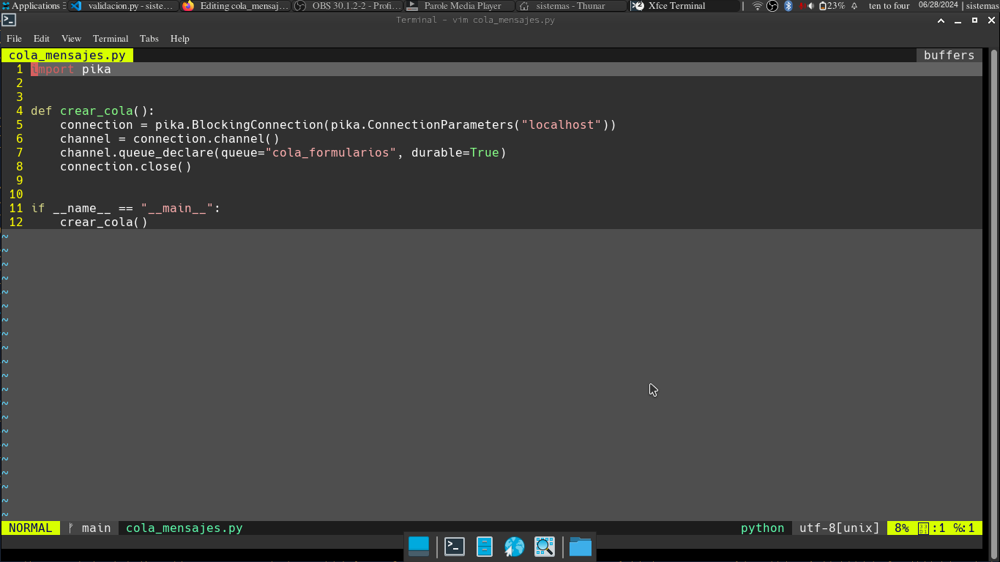
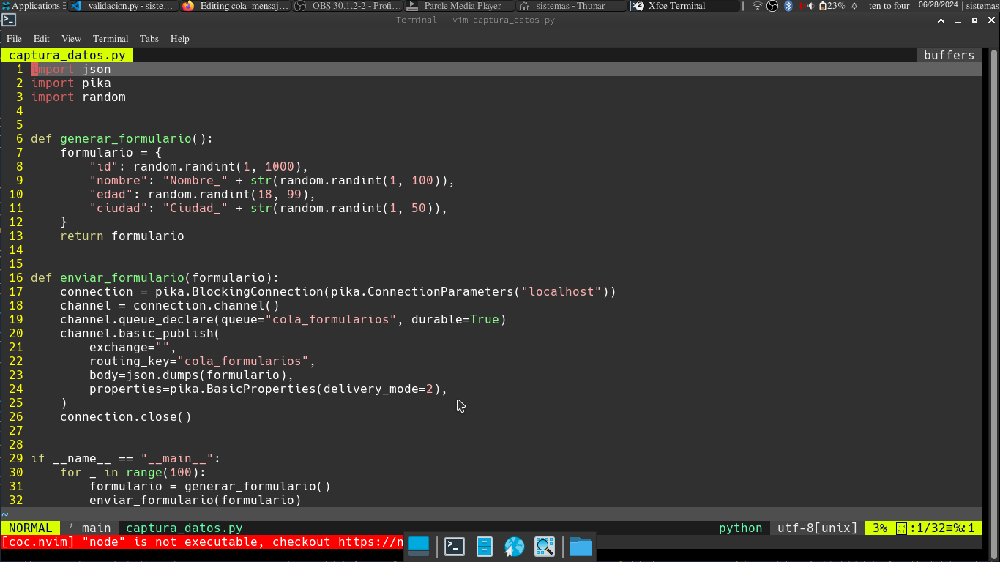
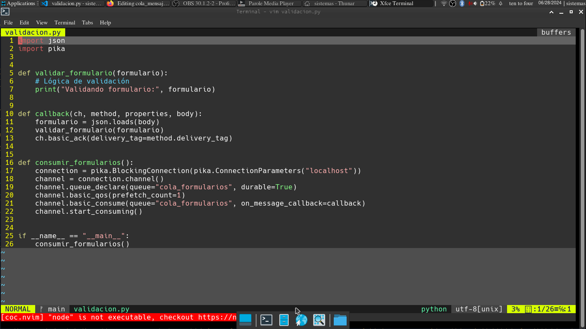
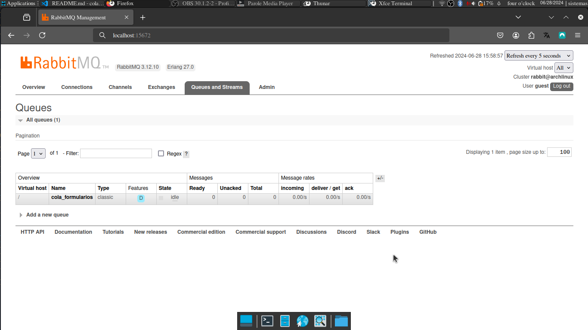
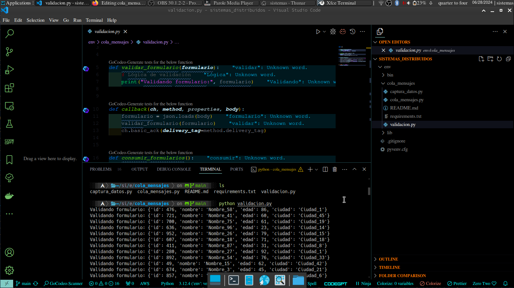

# Proyecto de Sistemas Distribuidos: Comunicación Indirecta

## Descripción del Proyecto

Este proyecto es parte de la asignatura de Sistemas Distribuidos y tiene como objetivo principal la construcción de un prototipo funcional de los primeros dos módulos y la implementación de la comunicación entre ellos a través de una cola de mensajes. El proyecto consta de los siguientes módulos:

1. **Módulo de Cola de Mensajes**
2. **Módulo de Captura de Datos**
3. **Módulo de Validación**

## Requisitos

- Python 3.x
- RabbitMQ
- Librerías de Python: `pika`

## Instalación

### Paso 1: Instalación de RabbitMQ

#### Windows

1. Descarga e instala [Erlang](https://www.erlang.org/downloads).
2. Descarga e instala [RabbitMQ](https://www.rabbitmq.com/install-windows.html).
3. Agrega `sbin` de RabbitMQ al PATH (ejemplo: `C:\Program Files\RabbitMQ Server\rabbitmq_server-3.x.x\sbin`).

Inicia RabbitMQ:
sh
rabbitmq-server.bat

#### Ubuntu

Actualiza el sistema e instala RabbitMQ:
sh
sudo apt-get update
sudo apt-get install rabbitmq-server
sudo systemctl enable rabbitmq-server
sudo systemctl start rabbitmq-server

#### Arch Linux

Actualiza el sistema e instala RabbitMQ:
sh
sudo pacman -Syu
sudo pacman -S rabbitmq
sudo systemctl enable rabbitmq.service
sudo systemctl start rabbitmq.service

### Paso 2: Instalación de las Librerías de Python

Asegúrate de tener `pip` actualizado:

#### Windows

sh
python -m pip install --upgrade pip

#### Ubuntu y Arch Linux

sh
sudo apt-get install python3-pip  # Ubuntu
sudo pacman -S python-pip  # Arch Linux
pip install --upgrade pip

Instala la librería `pika`:
sh
pip install pika

### Paso 3: Clonación del Repositorio

Clona este repositorio en tu máquina local:

## Uso

### Módulo de Cola de Mensajes

El script contiene la lógica para crear una conexión a RabbitMQ, enviar mensajes y recibir mensajes.

### Módulo de Captura de Datos

El script genera formularios de censo llenos de forma aleatoria y los envía a través de la cola de mensajes en formato JSON.

### Módulo de Validación

El script recibe formularios de la cola de mensajes, valida los datos y muestra el resultado de la validación.

### Ejecución de los Scripts

1. **Ejecutar el Módulo de Cola de Mensajes**:

2. **Ejecutar el Módulo de Captura de Datos**:

3. **Ejecutar el Módulo de Validación**:

## Estructura del Proyecto

## Capturas de Pantalla

## Video de Demostración
https://drive.google.com/drive/folders/1xTfATcHGdZhrNQrjYwLuD7WDWdFdbilh?usp=sharing

## Autores

- Marjorie Alexandra Monta Portilla
- David Antonio Fernandez Quituizaca
- Jessye Javier Solorzano Soriano

## Licencia

Este proyecto está licenciado bajo la Licencia MIT. Para más información, consulta el archivo LICENSE.